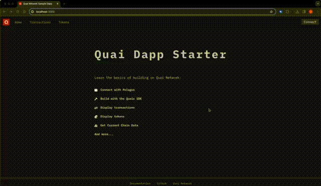

# quai-next-dapp

`quai-next-dapp` is a boilerplate dApp built on top of Quai Network using the [NextJS framework](https://next.js) in tandem with [Chakra-UI](https://chakra-ui.com/). The live version of this site is hosted at [quai-next-dapp.vercel.app](https://quai-next-dapp.vercel.app/).

## Features

- Using [Pelagus Wallet](https://pelaguswallet.io) in your application
- Handling accounts and data from all shards
- Fetching transaction data, tokens, and NFTs from [Quaiscan](https://quaiscan.io)
- Using the [quais SDK](https://npmjs.com/package/quais) to interact with Quai Network

## Demo



## Getting Started

Clone the repository and install the dependencies:

```bash
git clone https://github.com/dominant-strategies/quai-next-dapp.git
cd quai-next-dapp
npm install
```

Run the development server:

```bash
npm run dev
```

Open [http://localhost:3000](http://localhost:3000) with your browser to see the page.

## Components

### Pelagus Connection

Pelagus connection is achieved via the [`quais.BrowserProvider()`](https://docs.qu.ai/sdk/content/classes/BrowserProvider#browserprovider) method. The logic for connecting to Pelagus is located in the [`lib/useGetAccounts.ts`](./lib/useGetAccounts.ts) and [`requestAcccounts.ts`](./lib/requestAccounts.ts) files.

- The logic in `useGetAccounts` always runs on page load and attempts to get the user's accounts if connected. It also initiates a listener for the `accountsChanged` event.
- The logic in `requestAccounts` is only used in response to a direct user action. It prompts the user to connect their wallet and returns the accounts if successful.

### Data Fetching

`quai-next-dapp` fetches transaction data, tokens, and NFTs from the [Quaiscan API](https://quaiscan.io). The logic for fetching data is located in the [`lib/api/requests.ts`](./lib/api/requests.ts) and the [`pages/api/`](./pages/api) directory. NextJS API routes are used to fetch data server-side and return it to the client.

- The logic in `requests.ts` is used to fetch and transform data from NextJS API routes.
- The logic in the `pages/api/` directory is used to fetch data from the Quaiscan API and return it to the client.

### Design

`quai-next-dapp` uses [Chakra-UI](https://chakra-ui.com/) for styling and layout. A complete style config for custom components and theme is located in the [`styles/`](./styles) directory.
